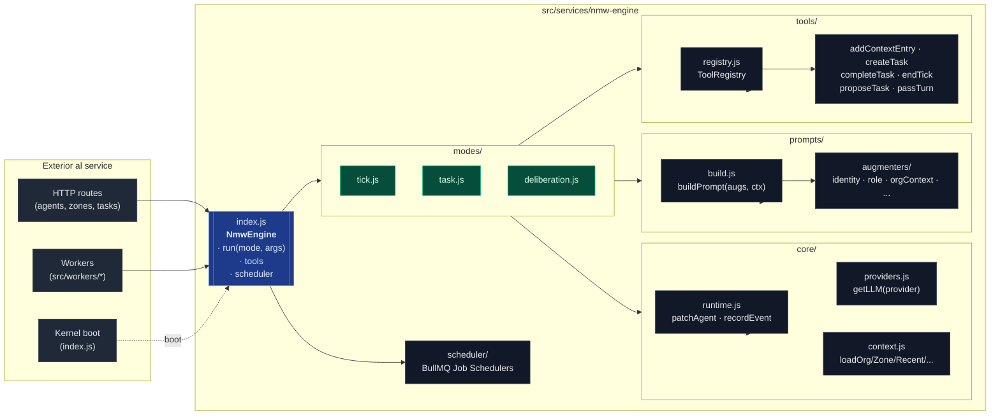
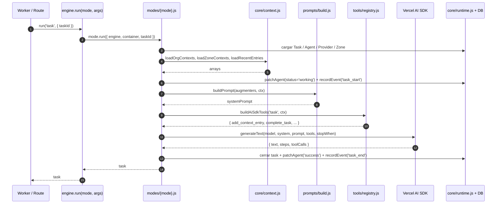
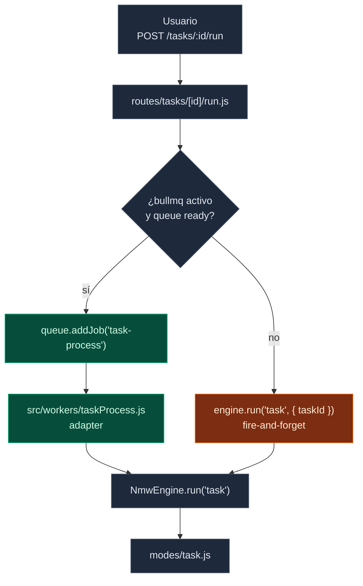
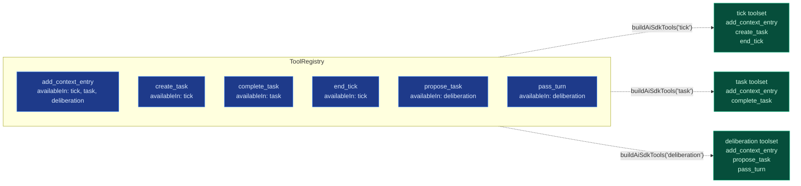
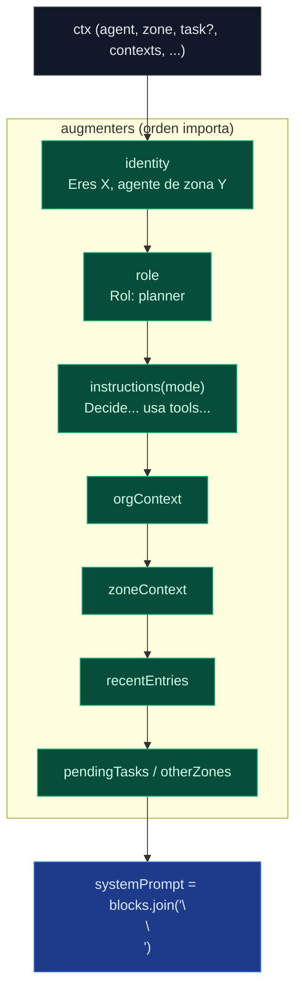
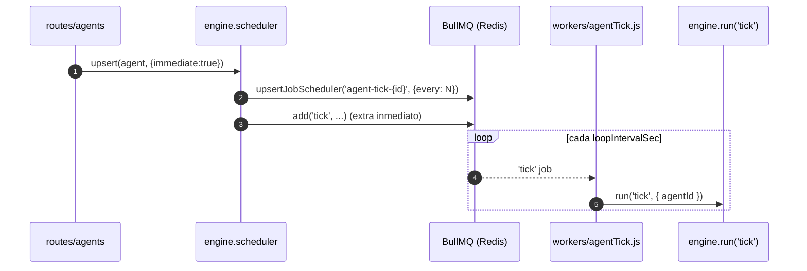

# nmw-engine — arquitectura visual

Diagramas en [Mermaid](https://mermaid.js.org/). GitHub y el preview de
Markdown de VSCode los renderizan nativamente. Para editar uno, modifica
el bloque de código directamente.

## 1. Vista de conjunto

Quién depende de quién dentro del service y desde dónde se invoca.

## 2. Vida de un **mode** (tick / task / deliberation)

Cada mode sigue el mismo patrón: cargar estado → construir prompt →
construir toolset → llamar LLM → persistir eventos.

## 3. Cómo se enruta una task desde el HTTP request

Desde que el usuario hace `POST /tasks/:id/run` hasta que el LLM corre,
con el fallback in-process si BullMQ no está disponible.

## 4. ToolRegistry — filtrado por mode

El registry guarda todas las tools registradas; al construir el toolset
para un mode concreto, sólo expone las que tienen ese mode en su
`availableIn`.

## 5. Anatomía de un prompt

Cada mode declara una lista de augmenters; `buildPrompt` los corre en
orden y concatena los bloques no-nulos con `\n\n`.

## 6. Scheduler de ticks

`engine.scheduler` administra los repeatable jobs de BullMQ que disparan
los ticks autónomos. Las routes lo invocan en create/update/delete de
agentes.

---

### Cómo regenerar / exportar a imagen estática

Si en algún momento necesitas un PNG/SVG en lugar del bloque Mermaid:

- **VSCode**: instala *Markdown Preview Mermaid Support* y haz screenshot
  desde el preview (rápido y suficiente para presentaciones).
- **CLI**: `npx -p @mermaid-js/mermaid-cli mmdc -i ARCHITECTURE.md -o
  diagram.svg` (requiere Chromium).
- **Online**: pega el bloque en <https://mermaid.live> y descarga.

Mantener los diagramas como Mermaid en el repo permite que evolucionen
con el código sin que se queden obsoletos.
